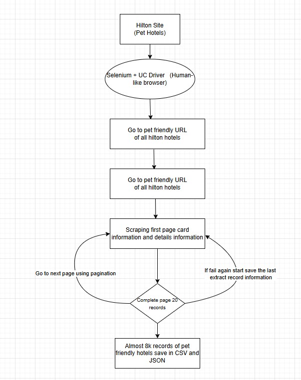

# 🐾 Hilton Pet-Friendly Hotels Scraper

A **production-ready Selenium scraper** that extracts **pet-friendly hotel data from Hilton’s official website** with full details including pet policies, parking, amenities, nearby places, and airport information.

This scraper is **resume-safe**, **anti-bot protected**, and saves data **incrementally** to both CSV and JSON formats.

---
## 🌐 Target Website
https://www.hilton.com/en/locations/pet-friendly/

---
## 🚀 Features

- ✅ Scrapes **all pet-friendly Hilton hotels**
- 🔄 **Resume support** after crash or stop
- 🛡️ Uses **undetected-chromedriver** to bypass bot detection
- 📦 Saves output to **CSV & JSON**
- 🧩 Extracts structured data:
  - Pet policies
  - Parking info
  - Amenities
  - Nearby places
  - Airport & shuttle info
- 🔁 Built-in retry & error handling
- 💾 Incremental saving (no data loss)

---

## 🧰 Tech Stack

| Tool | Purpose |
|----|----|
| Python 3.9+ | Core language |
| Selenium | Browser automation |
| undetected-chromedriver | Anti-bot protection |
| Google Chrome | Browser |
| CSV / JSON | Data output |

---

## 📂 Project Structure
| Files | Comments |
|----|----|
hilton-scraper/
| main.py      |              # Main scraper script
| hilton_pet_friendly_hotels.csv |    # Output CSV file
| hilton_pet_friendly_hotels.json |   # Output JSON file
| hilton_last_state.json  |  # State file for resuming
| requirements.txt      |    # Python dependencies

## Data Fields Collected

### Hotel Data Fields

- **hotel_code**
- **hotel_name**
- **address**
- **phone**
- **rating**
- **description**
- **card_price**
- **overview_table_json**
- **pets_json**
- **parking_json**
- **amenities_json**
- **nearby_json**
- **airport_json**
- **is_pet_friendly**
- **last_updated**

### Hotel Data Schema

| Field | Description | Example |
|------|------------|---------|
| **hotel_code** | Unique identifier | `"HILTON-1-3"` |
| **hotel_name** | Hotel name | `"Hilton San Francisco Union Square"` |
| **address** | Full address | `"333 O'Farrell St, San Francisco, CA 94102"` |
| **phone** | Contact phone | `"+1-415-771-1400"` |
| **rating** | Hotel rating | `"4.2/5"` |
| **description** | Hotel description | `"Located in downtown..."` |
| **card_price** | Price per night | `"$189"` |
| **overview_table_json** | Overview table data (JSON) | `{"Check-in": "3:00 PM", "Check-out": "12:00 PM"}` |
| **pets_json** | Pet policies (JSON) | `{"Pet Policy": "Dogs up to 75 lb allowed"}` |
| **parking_json** | Parking information (JSON) | `{"Parking": "Valet parking available"}` |
| **amenities_json** | Amenities list (JSON) | `["WiFi", "Pool", "Fitness Center"]` |
| **nearby_json** | Nearby attractions (JSON) | `[{"place": "Golden Gate Park", "distance": "2.5 mi"}]` |
| **airport_json** | Airport information (JSON) | `[{"airport": "SFO", "distance": "14 mi", "shuttle": "Available"}]` |
| **is_pet_friendly** | Pet-friendly status | `"true"` or `"false"` |
| **last_updated** | Timestamp of extraction | `"2024-01-15T10:30:00.000Z"` |

